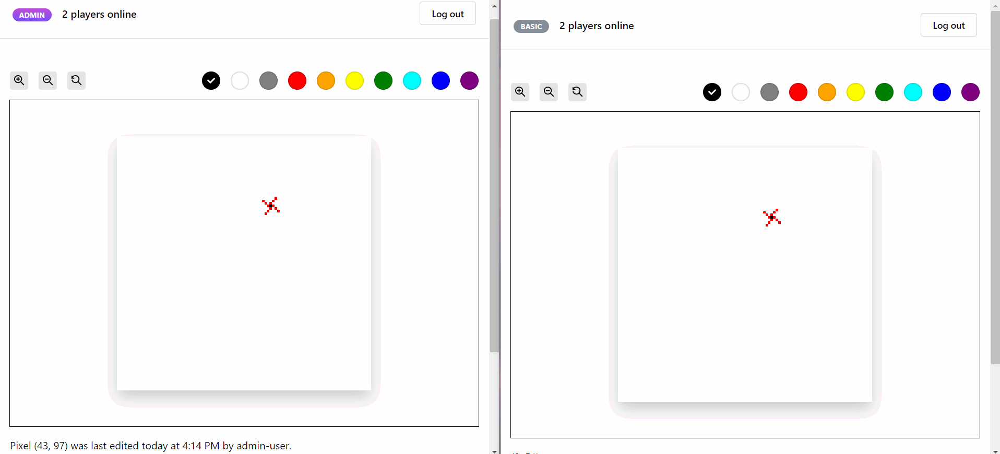

# art98 🎨


A real-time collaborative pixel art creation website built with MERN stack. This project was inspired by [`r/place`](https://en.wikipedia.org/wiki/R/place). Check out my [blog post](https://creme332.github.io/creamy-notes/posts/art98) to learn more about this project.



[Live Preview ▶](https://art98.vercel.app)

[View screenshots 📷](screenshots)

> 🔴 **Note**: art98 uses cookies to make requests to the server. If cookies are disabled on your browser or if you are using an incognito tab, you will not be able to login. 

> 🟡 **Note**: Actions such login and registering will take a few seconds to complete initially because the server spins down with inactivity and needs to spin back up after the first request. This is because the backend is hosted on a free instance type on Render.

> 🔴 **Disclaimer**: The artwork displayed on this website is user-generated and collaborative. Some content might be inappropriate or offensive. Please be aware that the images presented do not necessarily reflect my views.

## Features
- Supports 3 types of users (`Basic`, `Premium`, `Admin`):
    | Privilege                                                | `Basic`      | `Premium`      | `Admin`   |
    | -------------------------------------------------------- | ------------ | -------------- | --------- |
    | Number of pixels that can be drawn                       | 5 per minute | 20  per minute | Unlimited |
    | Inspect identity of online users                         | ❌            | ✅              | ✅         |
    | Inspect individual tiles to see who placed them and when | ❌            | ✅              | ✅         |
    | Reset board                                              | ❌            | ❌              | ✅         |
- Canvas user interaction: zoom, pan, pinch
- Web sockets for real-time drawing
- Jamstack architecture
- Session-based user authentication
- Password hashing with bcrypt
- Mobile-responsive UI
- Server-side validation and sanitization
- Guest sign-in functionality

## Installation
> 🔴 **Prerequisites**: Git, Node.js, a cluster on MongoDB Atlas.

Install the project:
```bash
git clone git@github.com:creme332/art98.git
```

Navigate to the `client` directory and install dependencies:
```bash
npm install
```

Create a `.env.local` file in `client` folder with the following:
```js
NEXT_PUBLIC_DEMO_EMAIL="demo@art98.com"
NEXT_PUBLIC_DEMO_PASSWORD="aaaaaa"
```

Navigate to the `server` directory and install dependencies:
```bash
npm install
```

Create a `.env` file in `server` folder and fill in the details:
```js
NODE_ENV="development" # change to production when deploying server
MONGO_STRING="<your connection string>/art98?retryWrites=true&w=majority"
SESSION_SECRET="any-random-string"
SALT_ROUNDS=10 # length of hashed password
ADMIN_KEY="" # secret passkey needed to become admin user
PREMIUM_KEY="" # secret passkey needed to become premium user
```

Navigate to the `server` directory and populate your database:
```bash
npm run populate
```
This should take 2-3 minutes.

## Usage
In one terminal, start frontend:

```bash
cd art98/client
npm run dev
```

In another terminal, start backend:

```bash
cd art98/server
npm run dev
```

Open [http://localhost:3000](http://localhost:3000) in your browser to see running website.

### How to play
- You must first create an account and then login to your account.
> 🟠 **Demo account**: To simply try out the website without any registration, you can click on the `Try demo` button on the homepage. However, this is not recommended as **anyone can access this account and use up the drawing limit**.

> 🟢 **Tip**: To become a `Premium` user, you must enter the secret key `1234` during registration.

- To draw a pixel on the canvas, you must **right-click** on a cell. On a touchscreen, you must **tap a pixel and hold**. 
- To move across the canvas, you must **drag** the canvas with left-click.
- To zoom in/out the canvas, you can either use the buttons with the magnifier icons or use the scroll wheel on your mouse.
- Hover on `x players online` to see names of currently online players.
- To change your user type once logged in, click on the the badge in the header describing your user type.


## To-do
- [ ] Refactor `server.js`
- [ ] Add how to play section on website
- [ ] Add new admin privilege: use custom colors on top of color palette
- [ ] Add download canvas option
- [ ] Rewrite backend in typescript

## References
- https://josephg.com/blog/rplace-in-a-weekend/
- https://www.redditinc.com/blog/how-we-built-rplace/
- https://dev.to/novu/building-a-chat-app-with-socketio-and-react-2edj
- https://github.com/rknoll/draw
